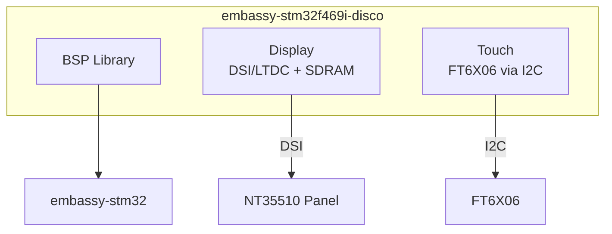
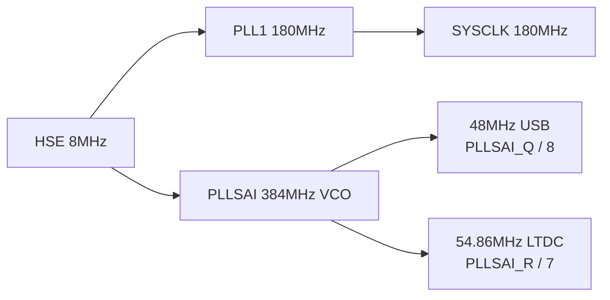

# embassy-stm32f469i-disco

Board support package for the [STM32F469I-Discovery](https://www.st.com/en/evaluation-tools/stm32f469i-discovery.html) board, built on the [Embassy](https://embassy.dev/) async framework.



> **Related BSP:** A sync (blocking) version using `stm32f4xx-hal` is available at [stm32f469i-disc](https://github.com/Amperstrand/stm32f469i-disc).
>
> - **Sync BSP:** Use for blocking HAL, `stm32f4xx-hal` compatibility, simpler code paths
> - **Async BSP (this repo):** Use for Embassy async/await, event-driven applications, multitasking

## Quick Start

```bash
# Install ARM target
rustup target add thumbv7em-none-eabihf

# Build
cargo build --target thumbv7em-none-eabihf

# Flash and run
probe-rs run --chip STM32F469NIHx --target thumbv7em-none-eabihf --example board_blinky
```

## Board API

`Board::try_new()` initializes SDRAM, display, touch controller, LEDs, and the user button in a single call:

```rust
use embassy_stm32f469i_disco::{Board, BoardHint};
use embedded_graphics::pixelcolor::Rgb888;

let p = embassy_stm32::init(embassy_stm32f469i_disco::config_180());
let mut board = Board::try_new(p, BoardHint::ForceNt35510).expect("board init");

// Access display framebuffer
let mut fb = board.display.fb();
fb.clear(Rgb888::BLACK);

// Poll touch
if let Ok(Some(point)) = board.touch.get_touch() {
    // point.x (0..479), point.y (0..799)
}

// Blink an LED
board.leds.green.toggle();

// Free pins after SDRAM bring-up (e.g. USART6 for a scanner)
let _tx = board.sdram_remainders.usart6_tx;
```

See `examples/board_display.rs` and `examples/board_touch.rs` for complete working examples.

## Features

| Feature | Description | Default |
|---------|-------------|---------|
| `display` | DSI/LTDC display via NT35510, embedded-graphics support | Yes |
| `touch` | FT6X06 capacitive touch via I2C1 | Yes |
| `bringup` | Historical bring-up and register-level examples | No |
| `defmt` | `defmt` logging support | No |

```toml
[dependencies]
embassy-stm32f469i-disco = { git = "https://github.com/Amperstrand/embassy-stm32f469i-disco", branch = "main" }
```

## Clock Configuration

The BSP provides clock presets that handle PLL/PLLSAI configuration. Use [`config_180()`] for full-speed operation (display + USB + touch), [`config_168()`] for 168 MHz, or [`config_usb_only()`] for USB without display.



See [docs/CLOCK-Configurations.md](docs/CLOCK-Configurations.md) for the full clock tree and register-level details.

## Hardware

- **MCU**: STM32F469NIH6 (Cortex-M4F, 180 MHz)
- **Display**: 480x800 RGB888 LCD via DSI/LTDC (NT35510)
- **SDRAM**: 16 MB via FMC (IS42S32400F-6BL)
- **Touch**: FT6X06 capacitive touch via I2C1
- **USB**: OTG FS (CDC-ACM)
- **LEDs**: 4 user LEDs (green, orange, red, blue)

## Examples

Board API examples are the recommended starting points. Build all with `cargo build --target thumbv7em-none-eabihf --examples`.

| Example | Description |
|---------|-------------|
| `board_blinky` | Blink all 4 LEDs using Board API |
| `board_display` | Draw text on display using Board API |
| `board_touch` | Poll touch coordinates using Board API |
| `extensive_hw_test` | Full interactive hardware test (39 tests, two-phase) |
| `display_hybrid` | Display with embedded-graphics |
| `display_touch` | Display + touch crosshair |
| `display_touch_rgb565` | Display + touch in RGB565 pixel format |
| `hw_diag` | On-screen hardware diagnostics |
| `test_display_interactive` | Interactive display diagnostics |
| `async_cdc_minimal` | USB CDC echo (st-flash, not probe-rs) |
| `test_usb_cdc_stress` | USB CDC stress test |

Bring-up examples (raw register access, `unsafe` code) require `--features bringup`:

```bash
cargo build --target thumbv7em-none-eabihf --examples --features bringup
```

## USB CDC

USB and display can coexist at both 180 MHz and 168 MHz with the correct clock configuration. Use the clock presets (`config_180()`, `config_168()`) instead of manual PLL setup.

```rust
// 180 MHz with USB + display + touch
let p = embassy_stm32::init(embassy_stm32f469i_disco::config_180());

// Reset USB PHY for clean re-enumeration after st-flash
embassy_stm32f469i_disco::reset_usb_phy();

// Now create USB driver
let driver = embassy_stm32::usb::Driver::new_fs(
    p.USB_OTG_FS, Irqs, p.PA12, p.PA11, ep_out_buffer, usb_config,
);

// Write CDC responses with automatic ZLP handling
embassy_stm32f469i_disco::send_with_zlp(&mut class, &buf[..n]).await.unwrap();
```

[`send_with_zlp`] chunks data into max-packet-size writes and appends a zero-length packet when the total length is an exact multiple of `max_packet_size`. Use it for any CDC write where the payload may land on a packet boundary (e.g. echo responses, protocol messages). Plain `write_packet` is sufficient for continuous streaming.

> **Important:** Use `st-flash` for USB firmware deployment. Do not use `probe-rs run` during USB testing, as the debug probe interferes with USB enumeration.

See `examples/async_cdc_minimal.rs` for a complete USB CDC example.

## API

| Export | Type | Description |
|--------|------|-------------|
| `Board` | struct | Ergonomic board initializer (SDRAM, display, touch, LEDs, button) |
| `Leds` | struct | 4 user LEDs (green, orange, red, blue), active-low |
| `UserButton` | struct | PA0 user button |
| `SdramRemainders` | struct | Free pins after SDRAM init (USART6 TX/RX) |
| `DisplayCtrl` | struct | DSI/LTDC display controller |
| `DisplayOrientation` | enum | `Portrait` (default, 480×800) or `Landscape` (800×480) |
| `FramebufferView` | struct | DrawTarget for embedded-graphics |
| `SdramCtrl` | struct | FMC SDRAM controller (16 MB) |
| `TouchCtrl<I2C>` | struct | FT6X06 touch controller (generic over any I2C) |
| `TouchPoint` | struct | Touch coordinates with `Clone`, `Copy`, `Display` |
| `TouchError<E>` | enum | Touch controller error type |
| `EdgeFilter` | struct | Phantom-touch rejection filter; `Default` = 3px FT6X06 margin, override with `EdgeFilter::none()` |
| `BoardHint` | enum | `Auto`, `ForceNt35510`, `ForceOtm8009a` |
| `config_180()` | fn | 180 MHz PLL config (display + USB + touch) |
| `config_168()` | fn | 168 MHz PLL config |
| `config_usb_only()` | fn | 168 MHz, USB without display |
| `reset_usb_phy()` | fn | Reset USB OTG FS PHY for clean re-enumeration |
| `send_with_zlp()` | fn | CDC write with automatic zero-length packet on packet-boundary payloads |
| `CdcAcmWriter` | trait | Abstraction over `CdcAcmClass` / `Sender` for `send_with_zlp` |
| `SYSCLK_HZ_180` | const | 180_000_000 |
| `SYSCLK_HZ_168` | const | 168_000_000 |
| `FB_HEIGHT` | const | 800 |
| `FB_WIDTH` | const | 480 |
| `SDRAM_SIZE_BYTES` | const | 16_777_216 (16 MB) |

## Known Issues

- **DSI reads** may fail during panel auto-detection. Use `BoardHint::ForceNt35510` to skip probe.
- **probe-rs** breaks USB enumeration. Use `st-flash` for USB CDC testing.
- **FT6X06** reports phantom touches at screen edges. Use `EdgeFilter::default_ft6x06()` to filter them.

See [AGENTS.md](AGENTS.md) for detailed hardware evidence, cross-project patterns, and upstream interaction policy.

## License

MIT OR Apache-2.0
