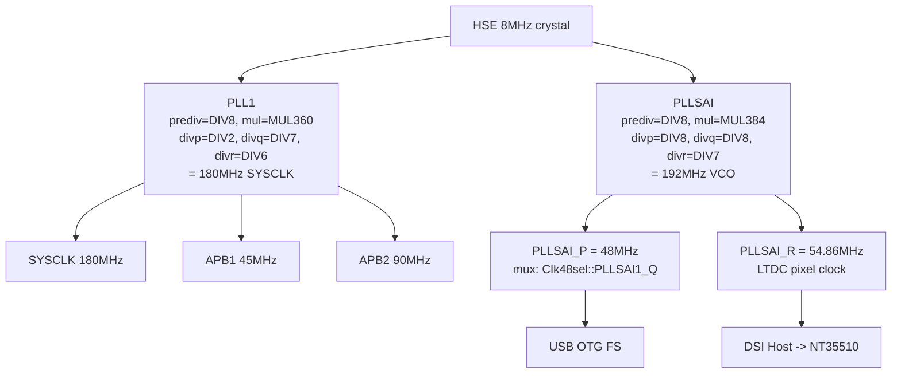

# Clock Configurations

Clock configuration is critical on the STM32F469I-Discovery because the display (DSI/LTDC) and USB OTG FS peripherals have independent clock requirements that must both be satisfied simultaneously. The BSP uses a dual-PLL scheme: PLL1 provides the 180 MHz system clock, while PLLSAI derives both the 48 MHz USB clock and the LTDC pixel clock from a single 192 MHz VCO.

## Clock Tree



### Clock Derivation Details

| Clock | Source | Calculation | Frequency |
|-------|--------|-------------|-----------|
| SYSCLK | PLL1_P | 8 MHz / 8 * 360 / 2 | 180 MHz |
| APB1 | AHB / 4 | 180 MHz / 4 | 45 MHz |
| APB2 | AHB / 2 | 180 MHz / 2 | 90 MHz |
| USB 48 MHz | PLLSAI_P | 8 MHz / 8 * 384 / 8 | 48.0 MHz |
| LTDC pixel | PLLSAI_R | 8 MHz / 8 * 384 / 7 | 54.86 MHz |
| PLL1_Q | PLL1_Q | 8 MHz / 8 * 360 / 7 | 51.43 MHz (not used) |
| PLLSAI_Q | PLLSAI_Q | 8 MHz / 8 * 384 / 8 | 48.0 MHz (same as P) |

Note: On STM32F469, the `Clk48sel::PLLSAI1_Q` enum is misleading. Hardware actually routes PLLSAI_P to the 48 MHz clock mux, not PLLSAI_Q. Both happen to produce 48 MHz with the configuration above.

## 180MHz Configuration (Production)

This configuration is production-verified and enables display, USB, and touch simultaneously at 180 MHz SYSCLK.

```rust
let mut config = embassy_stm32::Config::default();
config.rcc.hse = Some(Hse { freq: embassy_stm32::time::mhz(8), mode: HseMode::Oscillator });
config.rcc.pll_src = PllSource::HSE;

// PLL1: SYSCLK = 8MHz / DIV8 * MUL360 / DIV2 = 180MHz
config.rcc.pll = Some(Pll {
    prediv: PllPreDiv::DIV8,
    mul: PllMul::MUL360,
    divp: Some(PllPDiv::DIV2),
    divq: Some(PllQDiv::DIV7),
    divr: Some(PllRDiv::DIV6),
});

// PLLSAI: VCO = 8MHz / DIV8 * MUL384 = 384MHz
//   P = 384 / DIV8 = 48MHz (USB)
//   R = 384 / DIV7 = 54.86MHz (LTDC pixel clock)
config.rcc.pllsai = Some(Pll {
    prediv: PllPreDiv::DIV8,
    mul: PllMul::MUL384,
    divp: Some(PllPDiv::DIV8),
    divq: Some(PllQDiv::DIV8),
    divr: Some(PllRDiv::DIV7),
});

config.rcc.sys = Sysclk::PLL1_P;
config.rcc.ahb_pre = AHBPrescaler::DIV1;
config.rcc.apb1_pre = APBPrescaler::DIV4;
config.rcc.apb2_pre = APBPrescaler::DIV2;
config.rcc.mux.clk48sel = mux::Clk48sel::PLLSAI1_Q;

let p = embassy_stm32::init(config);
```

## ~~DCKCFGR2 Workaround~~ (INCORRECT — removed)

> **Correction (2026-05-07, issue #27):** The DCKCFGR2 workaround was based on an incorrect assumption. DCKCFGR2 **does not exist** on STM32F469 — the register at offset 0x94 reads back as 0 after write. CK48MSEL is in DCKCFGR bit 27, and embassy writes to the correct register.
>
> Hardware testing (`test_clk48_hypothesis`, conditions A-D) confirmed that the 48MHz clock works correctly without any DCKCFGR2 write. The write was always a no-op.
>
> The real mechanism: PLLSAI_Q = 48MHz (via `divq: Some(PllQDiv::DIV8)`), selected by `clk48sel = PLLSAI1_Q` which embassy writes to DCKCFGR (the correct register).

## Troubleshooting

| Symptom | Likely Cause | Solution |
|---------|--------------|----------|
| USB device not recognized by host | 48 MHz clock source incorrect | Verify PLLSAI_Q = DIV8 (48MHz), `clk48sel = PLLSAI1_Q` |
| USB enumerates but no data flows | probe-rs RTT blocking USB ISR | Use `st-flash --connect-under-reset` for USB testing |
| Display is black | PLLSAI_R not configured or wrong pixel clock | Verify `divr: Some(PllRDiv::DIV7)` on PLLSAI config |
| USB enumeration fails with probe-rs attached | probe-rs holds SWD, RTT blocks USB ISR | Use `st-flash --connect-under-reset` for USB testing |
| USB enumeration intermittent | defmt-rtt critical sections block USB OTG ISR | Remove `defmt-rtt` and `panic-probe` from production builds |
| MCU hard fault after USB enumeration | Double USART6 disable or other UB | Ensure peripherals are disabled only once |

## Related Documentation

- [USB-GUIDE.md](USB-GUIDE.md) - USB CDC setup and testing procedures
- [PIN-CONSUMPTION.md](PIN-CONSUMPTION.md) - GPIO pin usage by peripheral
- [known-issues.md](known-issues.md) - Known hardware and software issues
